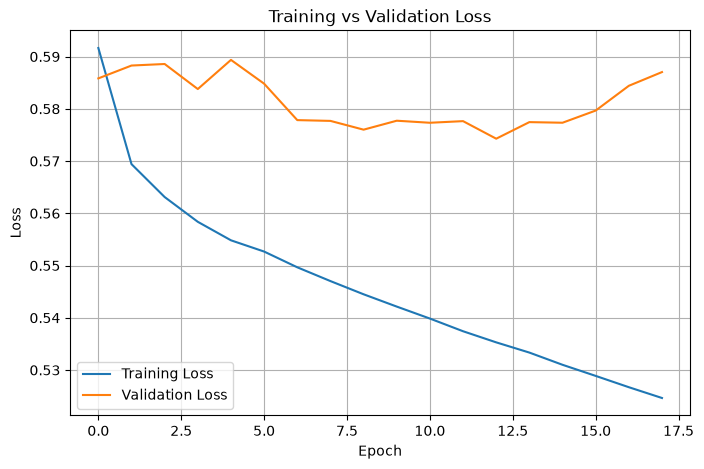
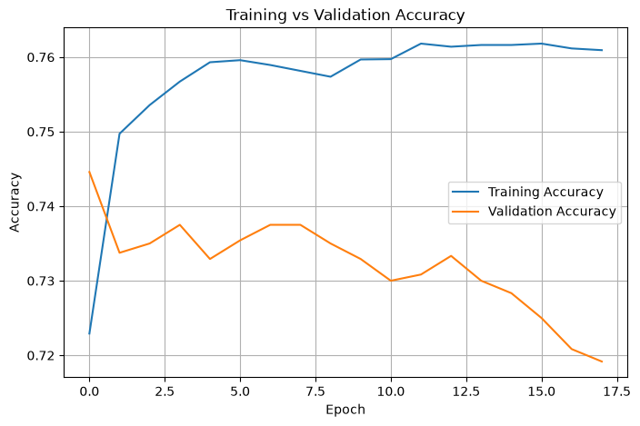
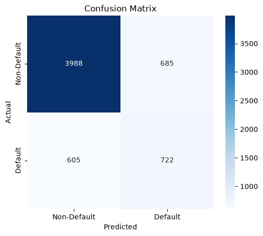
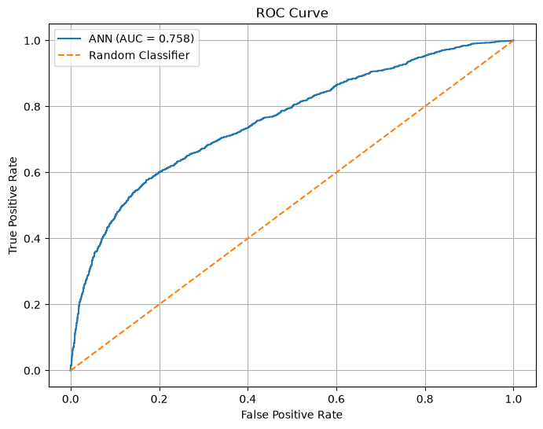
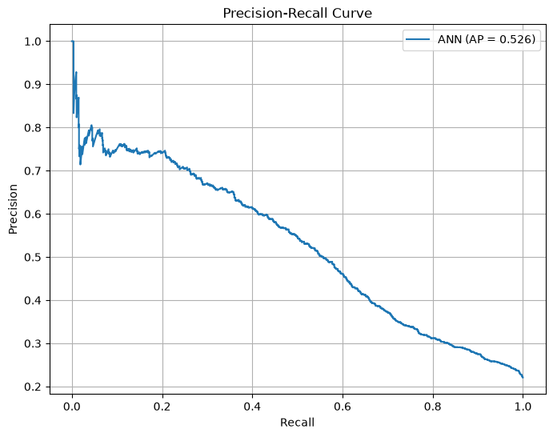

# Credit Card Default Prediction using ANN 💳🤖

An end-to-end Deep Learning (Artificial Neural Network) project to predict credit card client defaults for the upcoming month using customer demographic, financial, and payment history data.

---

## 📌 Project Overview

Defaulting on credit card payments poses a major financial risk to credit institutions and banks. Predicting potential defaults allows financial providers to proactively manage credit limits, manage risk exposure, and optimize collections.

This repository implements a complete Machine Learning / Deep Learning pipeline using **TensorFlow / Keras** and **scikit-learn** to analyze, preprocess, train, optimize, and evaluate a multi-layer Neural Network on credit card client data.

---

## 📊 Dataset Overview

- **Source File**: `credit_card_default.csv`
- **Total Records**: 30,000 clients
- **Target Variable**: `default_payment_next_month`
  - `0`: Non-Default (23,364 clients / 77.88%)
  - `1`: Default (6,636 clients / 22.12%)

### Key Features:
- **Demographics**: `LIMIT_BAL`, `sex`, `education`, `marriage`, `age`
- **Repayment Status (Apr - Sep)**: `payment_status_sep`, `payment_status_aug`, `payment_status_jul`, `payment_status_jun`, `payment_status_may`, `payment_status_apr`
- **Bill Amounts (Apr - Sep)**: `bill_amt_sep`, `bill_amt_aug`, `bill_amt_jul`, `bill_amt_jun`, `bill_amt_may`, `bill_amt_apr`
- **Previous Payment Amounts (Apr - Sep)**: `pay_amt_sep`, `pay_amt_aug`, `pay_amt_jul`, `pay_amt_jun`, `pay_amt_may`, `pay_amt_apr`

---

## 🛠️ Pipeline & Architecture

### 1. Preprocessing & Feature Engineering
- **Missing Value Handling**: Median imputation for numerical fields (`age`), custom categorical category (`"Unknown"`).
- **Payment Status Mapping**: Ordinal mapping of repayment status delay values.
- **Categorical One-Hot Encoding**: Converted `sex`, `education`, and `marriage` into binary dummy variables.
- **Data Splitting**:
  - Training Set: 21,600 samples (72%)
  - Validation Set: 2,400 samples (8%)
  - Testing Set: 6,000 samples (20% Stratified)
- **Feature Scaling**: Applied `StandardScaler` fitted on training data.
- **Class Imbalance Management**: Applied balanced `class_weights` during model training (`Class 0: 0.6420`, `Class 1: 2.2604`).

### 2. ANN Model Architecture
- **Input Layer**: 32 Features
- **Hidden Layer 1**: 64 Units (ReLU activation)
- **Hidden Layer 2**: 32 Units (ReLU activation)
- **Hidden Layer 3**: 16 Units (ReLU activation)
- **Output Layer**: 1 Unit (Sigmoid activation)

```
Input (32) ──> Dense(64, ReLU) ──> Dense(32, ReLU) ──> Dense(16, ReLU) ──> Dense(1, Sigmoid)
```

---

## 🏆 Model Performance & Evaluation Metrics

### Final Test Set Results (Decision Threshold = 0.60):

| Metric | Score |
| :--- | :--- |
| **Accuracy** | `78.50%` |
| **Precision** | `51.31%` |
| **Recall** | `54.41%` |
| **F1 Score** | `0.5282` |
| **ROC-AUC** | `0.7576` |
| **PR-AUC (Average Precision)** | `0.5263` |

### Confusion Matrix:

| | Predicted Non-Default (0) | Predicted Default (1) |
|---|---|---|
| **Actual Non-Default (0)** | **3,988** (TN) | **685** (FP) |
| **Actual Default (1)** | **605** (FN) | **722** (TP) |

---

## 📈 Visualizations & Graphs

### 1. Training vs Validation Loss
Tracks loss reduction over training epochs with Early Stopping.



---

### 2. Training vs Validation Accuracy
Monitors classification accuracy progression across training and validation sets.



---

### 3. Confusion Matrix Heatmap
Visualizes True Positives, True Negatives, False Positives, and False Negatives on test data.



---

### 4. Receiver Operating Characteristic (ROC) Curve
Displays True Positive Rate vs False Positive Rate (AUC = `0.758`).



---

### 5. Precision-Recall Curve
Plots Precision vs Recall performance across decision thresholds (Average Precision = `0.526`).



---

## 🖥️ Console Execution Output

```text
=================================================================
CREDIT CARD DEFAULT PREDICTION - ANN
=================================================================

Dataset Shape : (30000, 25)

Missing Values Before Preprocessing: 600
Duplicate Rows: 0

Target Distribution:
0    23364
1     6636

Target Percentage:
0    77.88%
1    22.12%

-----------------------------------------------------------------
AFTER PREPROCESSING
-----------------------------------------------------------------
Missing Values : 0
Dataset Shape  : (30000, 33)

Features (X)   : (30000, 32)
Target (y)     : (30000,)

=================================================================
DATA SPLIT
=================================================================
Training   : (21600, 32)
Validation : (2400, 32)
Testing    : (6000, 32)

Class Distribution:
Training   -> 0: 16822 | 1: 4778
Validation -> 0: 1869  | 1: 531
Testing    -> 0: 4673  | 1: 1327

Class Weights:
Class 0: 0.6420
Class 1: 2.2604

=================================================================
ANN MODEL
=================================================================
 Total params: 4,737 (18.50 KB)
 Trainable params: 4,737 (18.50 KB)

=================================================================
VALIDATION THRESHOLD ANALYSIS
=================================================================
Threshold   Precision   Recall      F1 Score    
------------------------------------------------
0.10        0.232       0.985       0.376       
0.15        0.242       0.957       0.386       
0.20        0.258       0.932       0.404       
0.25        0.273       0.896       0.419       
0.30        0.295       0.866       0.441       
0.35        0.321       0.798       0.458       
0.40        0.352       0.733       0.476       
0.45        0.393       0.663       0.493       
0.50        0.427       0.599       0.498       
0.55        0.467       0.574       0.515       
0.60        0.509       0.531       0.520  <-- BEST F1
0.65        0.537       0.480       0.507       
0.70        0.570       0.446       0.501       
0.75        0.618       0.399       0.485       
0.80        0.657       0.350       0.457       
0.85        0.695       0.266       0.384       
0.90        0.690       0.130       0.219       

BEST THRESHOLD = 0.60
Validation Precision = 0.509
Validation Recall    = 0.531
Validation F1 Score  = 0.520

=================================================================
FINAL TEST RESULTS
=================================================================
Decision Threshold   : 0.60
Accuracy             : 0.7850
Precision            : 0.5131
Recall               : 0.5441
F1 Score             : 0.5282
ROC-AUC              : 0.7576
Average Precision    : 0.5263

-----------------------------------------------------------------
CONFUSION MATRIX
-----------------------------------------------------------------
[[3988  685]
 [ 605  722]]

TN = 3988 | FP = 685
FN = 605 | TP = 722

-----------------------------------------------------------------
CLASSIFICATION REPORT
-----------------------------------------------------------------
                 precision    recall  f1-score   support

Non-Default (0)       0.87      0.85      0.86      4673
    Default (1)       0.51      0.54      0.53      1327

       accuracy                           0.79      6000
      macro avg       0.69      0.70      0.69      6000
   weighted avg       0.79      0.79      0.79      6000

=================================================================
END OF EXPERIMENT
=================================================================
```

---

## 📁 Repository Structure

```
credit-card-default-prediction/
├── credit_card_default.csv     # Raw dataset file
├── dataset.py                  # Kaggle dataset downloader script
├── main.py                     # Main execution pipeline
├── README.md                   # Project documentation
├── .gitignore                  # Git ignore rules
├── loss_curve.png              # Training vs Validation loss plot
├── accuracy_curve.png          # Training vs Validation accuracy plot
├── confusion_matrix.png        # Confusion matrix heatmap plot
├── roc_curve.png               # ROC curve plot
└── precision_recall_curve.png  # Precision-Recall curve plot
```

---

## 🚀 How to Run

### 1. Prerequisites
Ensure Python 3.10+ is installed along with dependencies:

```bash
pip install pandas numpy matplotlib seaborn scikit-learn tensorflow kagglehub
```

### 2. Execute Script
Run `main.py`:

```bash
python main.py
```

---

## 📝 License

This project is open-source and available under the MIT License.
